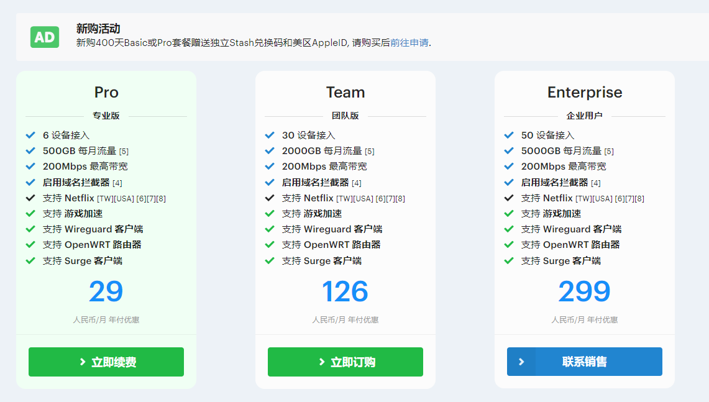
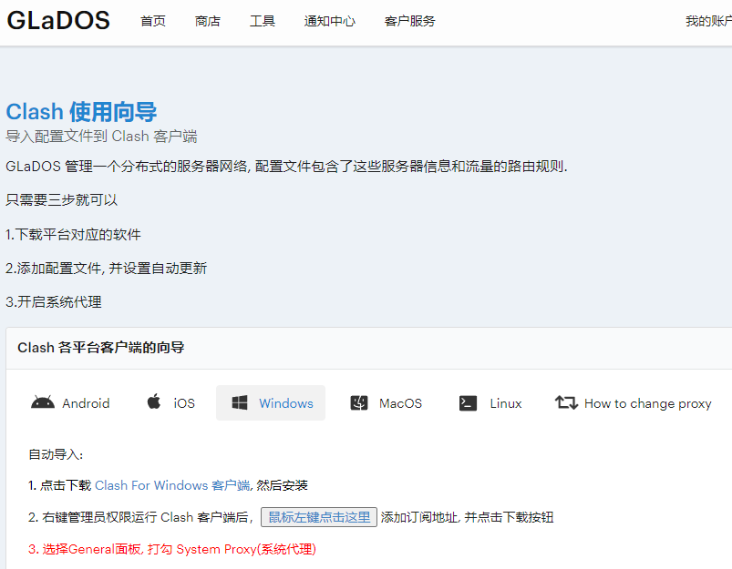
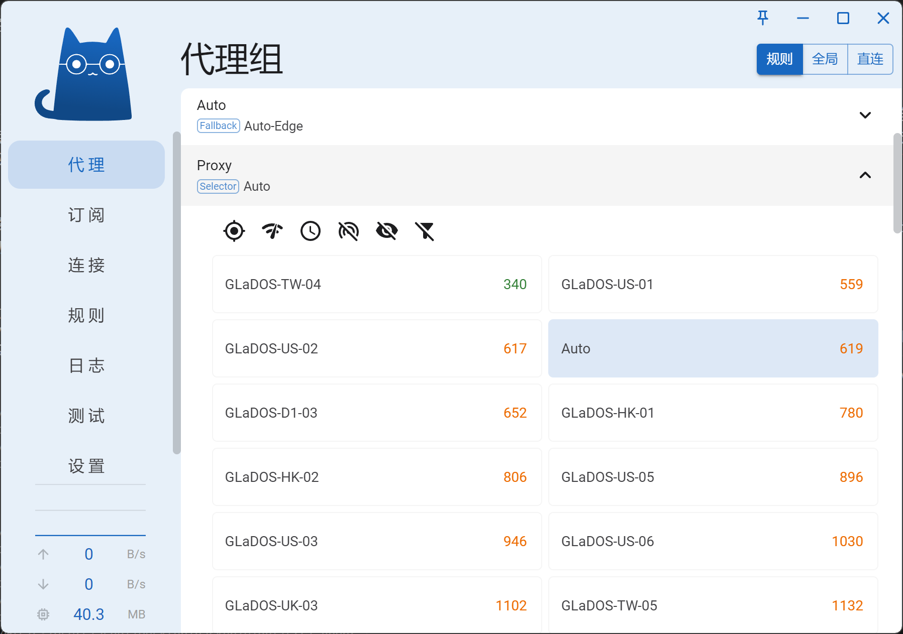
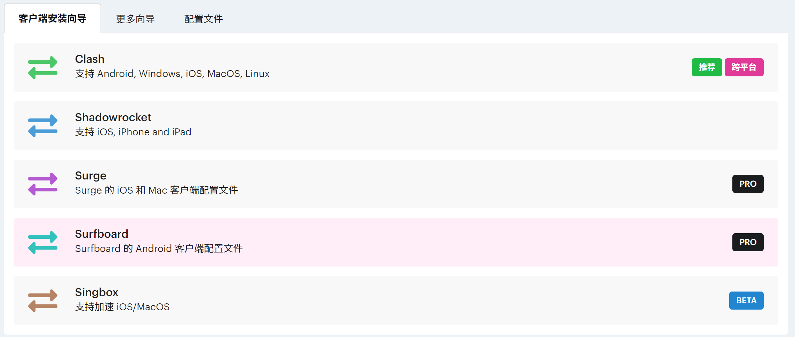
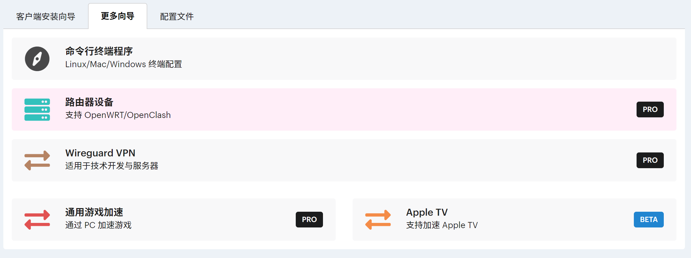

:::tip
如果觉得 glados 挺好用的话，在购买之前也可以填写一下我的邀请码，我们都会获得一定天数的奖励。这也是对我的激励，谢谢！

```txt
ZI0FM-ZYSS9-6P4NT-47NSN
```

:::

## 前言

关于科学上网，一直有两个派别存在，那就是自建主机党和机场党。自建主机的好处就是极高的自由度，有一个虚拟主机可供差遣，你可以在上面搭个网站，搞点在线服务，挂点 24 小时的脚本等等；但是嘛也同样存在问题，一旦主机被墙，万事休矣，而且花费更高。所以自建主机只适合愿意折腾和动手的用户，而且最好有备用上网手段，不然很容易抓瞎。

## glados

所以对于只想上网看点东西的普通用户来说，其实购买机场的服务是一个更好的选择。现在很多机场用起来其实都挺方便的，服务也挺全的。这里就给大家介绍我自己在用的机场服务——[glados](https://glados.rocks/)。目前我用了三年多了，用起来挺不错的。

### 套餐

首先介绍一下 glados 的套餐，分为多个版本，~~套餐调整之后以前的月付 11 元的基础版套餐没了~~。glados 支持在购买前试用，所以你大可以先试用一下再决定要不要购买。



### 使用

然后按照 glados 的提示下载 Clash For Windows，导入订阅链接即可使用。



安装好 Clash For Windows 后，打开软件，在按照官网的提示点击*添加订阅*按钮（如上图所示），Clash For Windows 应该就会收到请求并自动添加订阅。然后点击左边的 General，选中 System Proxy 开启系统代理；再点击左边的 Proxies，点击上方的 Rule 按钮，将代理规则改为规则模式。这时候就应该可以随心所欲的上网了，你可以打开浏览器访问一下 [谷歌](https://www.google.com)，不出意外的话应该就可以成功访问了。

当然，你这时候应该也发现了，glados 提供的不是单个节点的服务，而是很多个节点，这些节点由 clash 来负责，可以根据延迟和配置文件里预先设定好的规则进行切换。这样我们的上网可用性就会大大提高。当然这也有一个缺点，因为节点会自动切换，所以有时候一些网站会判定成异地登录，触发验证机制。遇到这种情况的话，可以找到 Proxy 节点组，选择一个延迟较低的节点组而不是默认的自动切换 Auto 节点组，这样就不会自动切换了。



### 多客户端支持

如果需要其他系统的客户端，glados 也有相关的帮助信息，照着网页上的提示下载对应的客户端就可以了。这也是我选择 glados 的一个原因，客户端的支持比较完善，除了常用的 clash 相关客户端以外，还支持 shadowrocket、surfboard、singbox、wireguard 、netch 游戏加速等多种类型，可以满足各种需求。





### 签到

glados 可以通过每日签到的方式增加使用天数，每日签到获取随机点数，满 100 点可以兑换 10 天会员。可以将 [签到地址](https://glados.rocks/console/checkin) 收藏到浏览器里，每天记得签到。

### 优惠码

:::tip
如果觉得 glados 挺好用的话，在购买之前也可以填写一下我的邀请码，我们都会获得一定天数的奖励。这也是对我的激励，谢谢！

```txt
ZI0FM-ZYSS9-6P4NT-47NSN
```

:::
