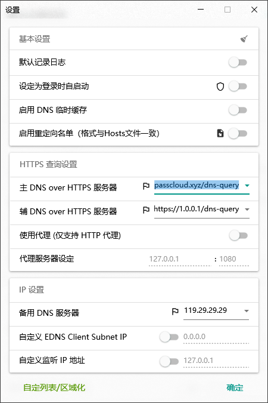
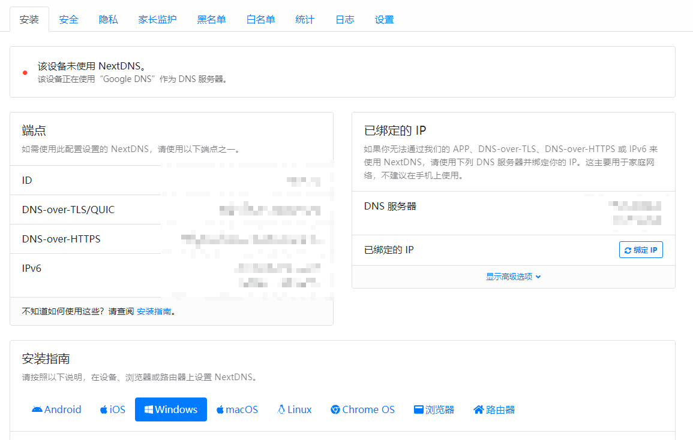
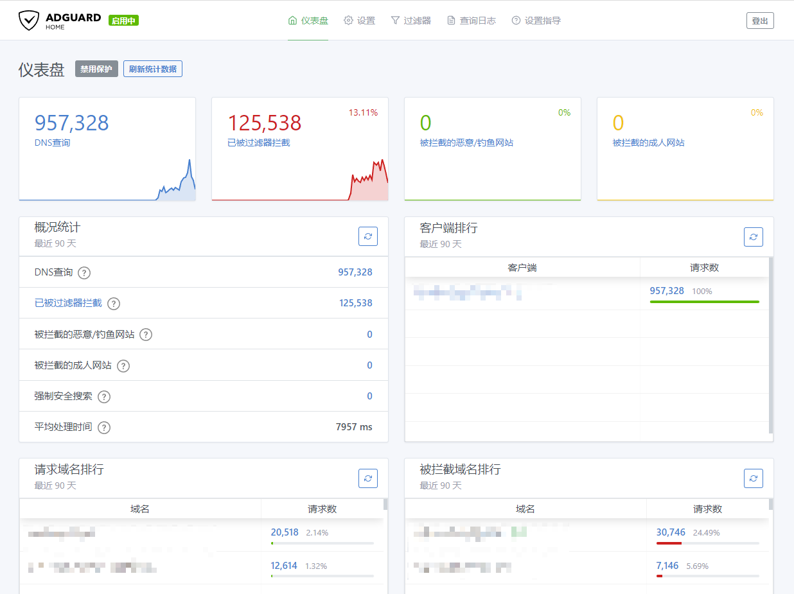

通常情况下我们都会使用系统默认的域名解析服务（后面简称 DNS），但是这样做就会产生隐私问题。因为默认的 DNS 使用 53 端口号且没有进行加密，所以不仅墙可以知道你访问了什么网站，运营商们也会进行一些小动作，比如悄悄的往 DNS 里添加一点广告，这就是俗称的 DNS 污染。

所以为了解决这个问题，就产生了加密 DNS 这一技术，主要有 DOT（DNS over TLS，通过 TLS 协议传输 DNS 协议）以及 DOH（DNS over HTTPS，通过 HTTPS 协议传输），最近还有一个 DOQ（DNS over QUIC，通过 QUIC 协议传输）。DOT 协议在墙内被封的比较厉害，而 DOQ 协议比较新，大家的支持力度还不够。所以主流还是推荐使用 DOH 协议。

## AuroraDNS.GUI

每个系统和应用的设置 DNS 的方法都各不相同，请查阅各自的文档。如果仅仅是 Windows 系统想要使用 DOH 的话，可以试试这个简单的小程序，内置了不少 DOH，同时支持一键设置 DOH，免去了手动配置的麻烦。

<https://github.com/mili-tan/AuroraDNS.GUI>

打开程序之后，在设置中选择要使用的 DOH 服务器，然后点击保存。然后在软件主界面中点击左边的*设为系统 DNS*，这样就能使用 AuroraDNS 了。



## NextDNS

NextDNS 在国内已经被墙，所以除非使用 AdGuard Home 做分流，否则不用想着在国内使用了，大家看看就好。不过这个东西看起来也蛮不错的，所以这里还是介绍一下。

NextDNS 支持统计信息，在官网注册一个账号之后，就可以获得自己的独特 DNS 解析地址，将设备的 DNS 设置为 NextDNS 之后，过一段时间就可以在 NextDNS 中看到统计信息了。



## AdGuard Home

[AdGuard Home](https://github.com/AdguardTeam/AdGuardHome) 是一个开源的 DNS 服务器，可以通过配置规则达到去广告和保护隐私的目的。不过 AdGuard Home 作为一个开源的 linux 程序，配置起来比较麻烦，这里就不作过多介绍了。

AdGuard Home 推荐部署在家里常驻的设备上，例如软路由、树莓派、NAS 或者其他 24 小时开机的计算机设备。同时为了部署方便，设备最好支持 docker，这样可以只使用几条命令就轻松的部署 AdGuard Home。

### docker 部署

运行以下命令启动 adguardhome。

```sh
docker run --name adguardhome \
  --restart unless-stopped \
  -v /my/own/workdir:/opt/adguardhome/work \
  -v /my/own/confdir:/opt/adguardhome/conf \
  --network host -d adguard/adguardhome
```

等待命令执行完，确认一下 adguardhome 是否启动成功。如果出现 UP 字样，说明 adguardhome 成功启动。

```sh
docker ps
```

然后在浏览器中访问 <https://hostname:3000>，其中`hostname`是你部署 adguardhome 的设备主机名或者 IP 地址，根据提示进行操作。成功配置之后，无需额外指定端口号，就可以通过 <https://hostname> 主机名或者 IP 地址来访问和配置 adguardhome 了。

### 设置

adguardhome 的设置可以通过 web 界面来进行，通常需要配置的有*设置->DNS 设置->配置上游 DNS 服务器*，在这里配置 adguardhome 使用的 DNS 服务器，我目前在使用 IQDNS；*过滤器->DNS 拦截列表*，在这里配置要拦截的 DNS 列表，根据自己的需要启用相关的拦截列表即可。

配置完成之后，将家里各设备的 DNS 服务器设置为运行 AdGuard Home 的设备 IP 地址即可。如果设备是常驻的，也可以直接在路由器中将 DNS 服务器设置为 AdGuard Home，这样家里的其他设备就不需要设置了。在使用一段时间之后，还可以在 AdGuard Home 中查看统计信息。



AdGuard Home 还有很多高级用法，比如设置国内外域名分流等等，以后在介绍吧。
