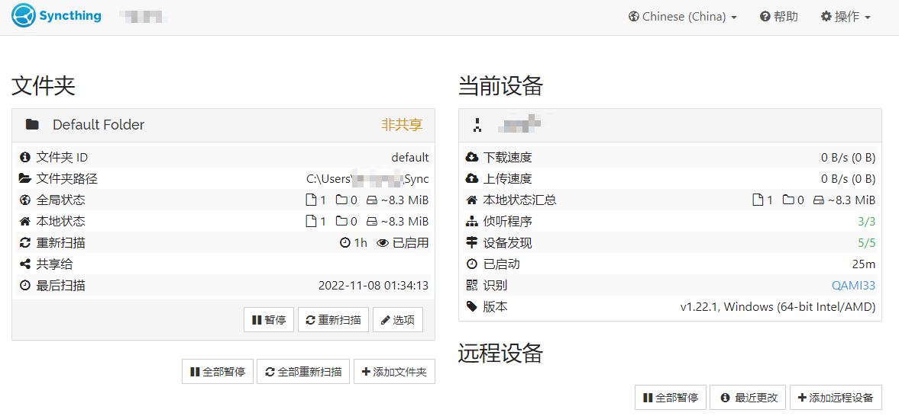
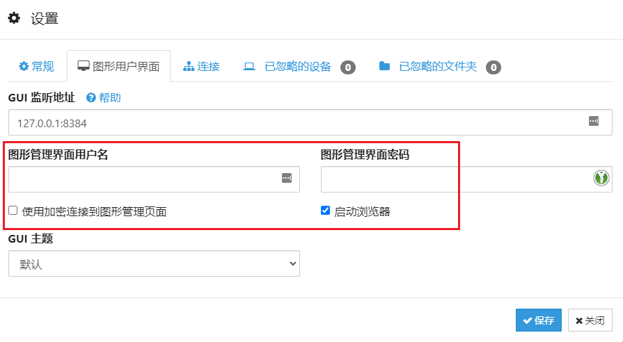
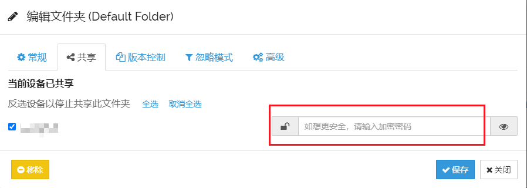

这是一个开源的跨平台文件分享工具。

## 开始使用

### 安装

有两种安装方式，第一种就是直接下载压缩包。到 [项目发布页](https://github.com/syncthing/syncthing/releases) 寻找发布的最新版，然后在项目资产（Assets）中寻找适合自己系统的压缩包并下载。例如现在常用的 64 位 windows 系统，就去寻找类似`syncthing-widows-amd64-v1.22`名称的压缩包（记得点开完成的列表再找，适合 windows 版本的在最下面！）。

如果无法下载的话参考 [解决 Github 访问问题](/network/github)。下载之后解压就获得了可以运行的文件夹。

如果你想使用命令行方式安装，还可以试试 scoop 这个工具，安装配置好之后可以像 linux 系统那样通过命令行方式安装。

```sh
scoop install syncthing
```

### 启动

下载好之后，就可以通过双击`syncthing.exe`或者命令行运行`syncthing`的方式启动软件。启动之后应当会自动打开浏览器，并显示 web 管理界面。



### 添加远程设备

在同步之前需要先配置远程设备，需要得知设备 ID。设备 ID 可以通过右上角菜单*操作->显示 ID *的方式获得，有了 ID，点击右下角的*添加远程设备*即可将对方添加为远程设备。对方同时也会弹出确认对话框，同意之后，双方就成功互相添加了。

### 同步文件

默认情况下同步文件夹位于`~/Sync`。在添加远程设备之后，在远程设备和共享文件夹的选项设置中，都可以找到共享的标签页，将文件夹设置为共享状态。对方也会收到共享提示，确认之后，syncthing 就会开始在双方之间同步文件夹的内容。

### 密码保护

如果只是临时传一下文件，不使用密码保护也可以。但是如果准备将 syncthing 作为文件传输服务长期运行的话，必然需要添加保护措施，避免被他人盗用。

首先需要保护的是 web 界面，可以通过添加用户名和密码的方式来保护，这样下次登录的时候就必须输入用户名和密码才能访问 web 界面了，*使用加密连接*也一并开启，这样就会使用 HTTPS 方式登录，提供更好的保护。



共享文件夹最好也添加密码保护。


