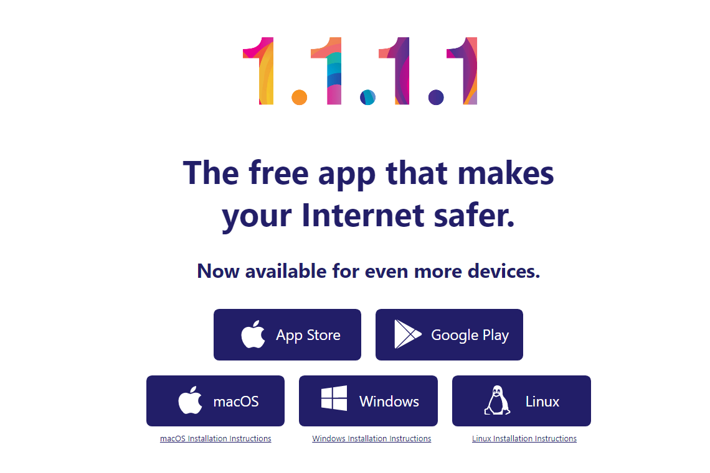

Warp 是 Cloudflare 推出的一个隐私保护工具，可以将用户的所有网络流量经由 Cloudflare 网络传输，可以有效的保护用户隐私。如果不需要的话也可以改为 DNS 模式，这时候 warp 只会将系统的 DNS 请求经由 Cloudflare 解析。

不过比较遗憾的是，warp 采用的 wireguard 协议，已经被 gfw 墙了，因此墙内用户无法正常使用 warp。不过 warp 作为一个很不错的隐私保护工具，这里还是介绍一下吧。

## 安装

直接到 [warp](https://1.1.1.1) 下载 warp 就可以了，各个平台客户端都有，按需要下载。

Cloudflare 直接把 <https://1.1.1.1> 这个 IP 地址当作域名来用，有钱，任性！

## 使用

warp 第一次启动的时候会联网 cloudflare 进行注册，然后就能连接 Cloudflare 网络，当然，这只是在正常情况下，墙内用户是没办法正常连接的。不过倒是可以使用代理软件的全局模式（例如 Clash for Windows 的 TUN 模式）来连接，但是代理软件的全局模式又和 wireguard 的全局模式冲突，这也正是可惜的地方了。

所以这时候只能采用 warp 的代理模式，这会打开一个端口，warp 会将该端口上的所有流量代理给 Cloudflare。不过既然你都开了全局代理了，其实也没有必要使用 warp 了。要匿名的话，其实用 Tor 浏览器就差不多够了。

## warp+

前面说了 warp 已经被 gfw 墙了，但是其实 warp 还有一个付费版的服务 warp+，目前还可以在墙内正常使用。恰好，warp+也有对应的白嫖方法。

想要白嫖 warp+，需要你有一个 telegram 账号，然后添加 [👉 这个机器人](https://t.me/generatewarpplusbot)，添加之后，机器人会要求你再添加两个频道，添加成功之后，就可以通过机器人的命令生成白嫖的密钥。

输入`/generate`命令，机器人会询问你一个简单的算数问题，回答的时候使用`/generate 答案`，回答成功之后就可以获得密钥。然后打开 warp 的*设置->账户->使用其他密钥*，将刚刚得到的密钥粘贴进去并保存。

重启程序之后，应该就可以看到 warp 变成了 warp+，同时流量有 12PB 之多！这时候连接，应该就可以通过 warp+来翻墙上网了。
