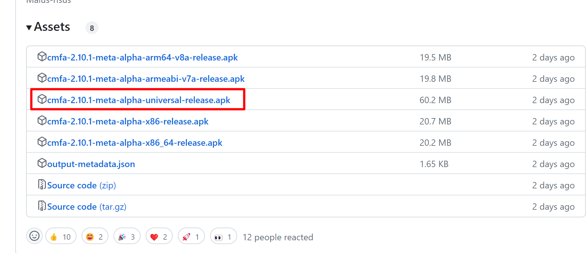
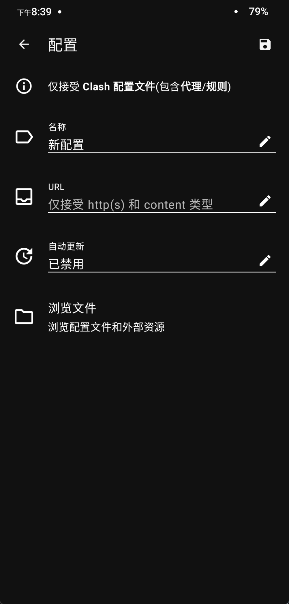
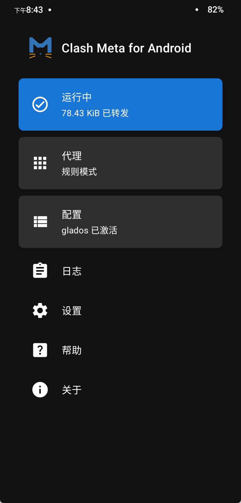

[Clash Meta For Android](https://github.com/MetaCubeX/ClashMetaForAndroid) 是一个基于 Clash Meta 内核的开源安卓客户端，在原来的 Clash For Android 跑路之后，是目前使用最多的安卓客户端。

## 下载和安装

软件的下载地址可以在 [官方仓库的发布页](https://github.com/MetaCubeX/ClashMetaForAndroid/releases) 找到，如果不知道自己的设备架构类型，可以直接选择 universal 类型的安装包。

## 开始使用

### 添加订阅

打开软件主界面的配置按钮，点击右上角的加号，打开配置界面，选择从 URL 导入，然后填写配置的名称，订阅链接和自动更新间隔（单位：秒）。

### 启动应用

### 快捷启动栏

如果经常使用 Clash Meta For Android 的话也可以将其添加到手机的快捷启动栏，以便下次快捷启动。方法很简单，打开手机下拉通知栏，点击✏️形状的设置按钮，找到 Clash Meta For Android 的按钮，将其拖动到要放置的位置，这样下次就可以直接从快捷启动栏打开应用了。
