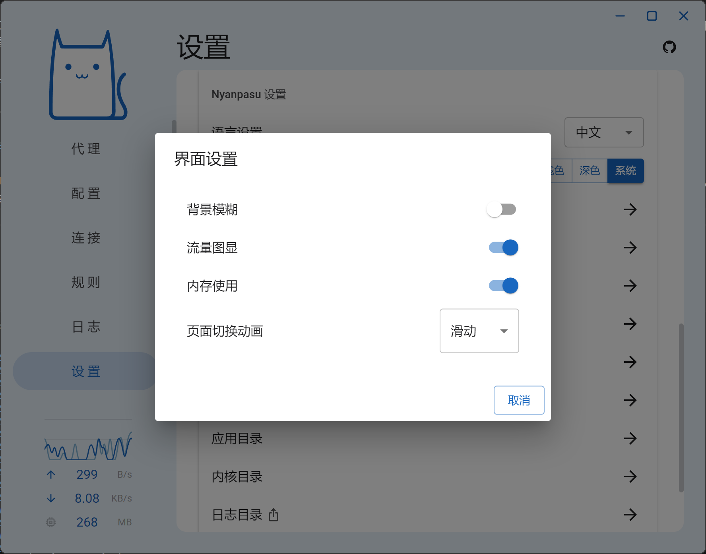
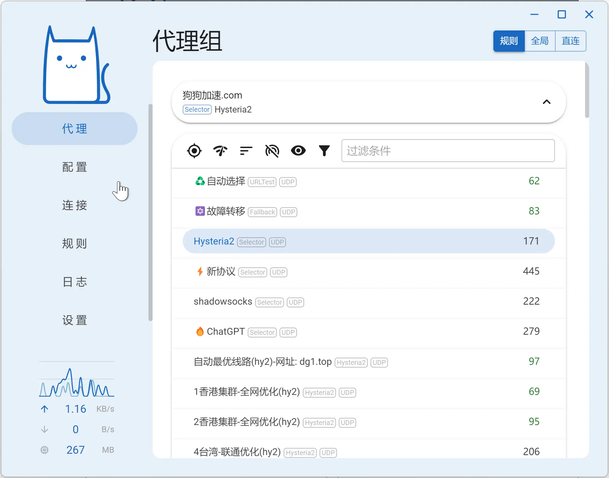
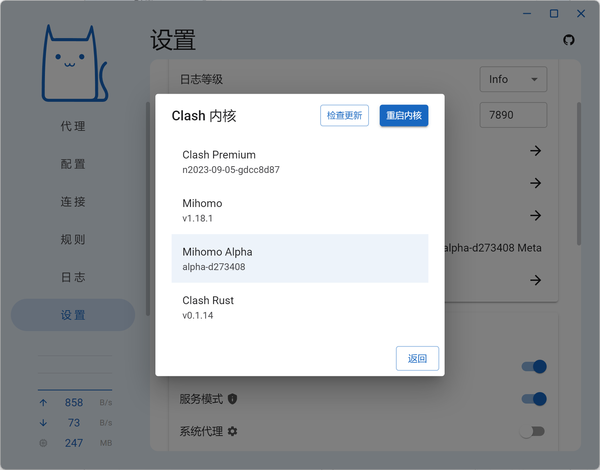

Clash Nyanpasu 是一个 Windows 平台的 Clash 图形客户端，看名字就可以看出来，这个客户端看起来比较萌🐱，不仅仅是名字萌，软件的图标也很萌。

不过其实这个客户端也没有太多可说的，因为 Clash 的客户端功能上都是大同小异，而且这个客户端和 Clash Verge Rev 一样都使用了 tauri 作为图形界面开发技术，也使用了类似的界面样式，所以他们其实看起来就好像亲兄弟一样……

所以呢，这里就简单介绍一下 Clash Nyanpasu 的一点特色功能。如果大家喜欢的话也可以尝试一下这个客户端。

## 软件特色

### 切换动画

好吧，这个功能其实没什么用，但是他至少好看不是吗？感觉作者只是想尝试一下切换动画这个功能，所以才在软件上添加了这么一个功能。不过呢本来这几个软件主页上就写着以学习为目的才开发了这么个软件，很合理。

切换动画的效果如图所示。

### 内核切换

这个算是一个比较实用的功能了，虽然其实也没啥用，毕竟现在只有一个 mihomo 内核在活跃开发，将来有新协议的话旧的内核也不会支持，所以没有问题的话那么肯定还是优先使用新内核。

