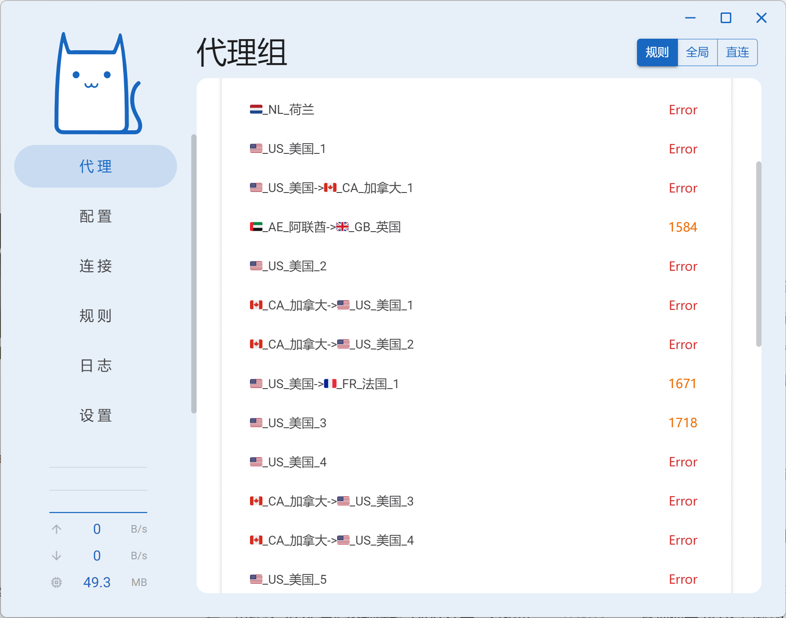

如果不想为了翻墙而付费，其实网络上也有一些免费的节点可供使用。不过既然是免费的节点，也就不要指望速度有多快了，而且不排除可能存在一些钓鱼节点。总之呢就是一句话，免费的才是最贵的。

## 免费节点

### FreeProxyTor

[项目主页](github.com/MakeFortuneQuietly/FreeProxyTor) 中介绍了节点的使用方法。首先根据项目中的指引下载 v2ray 软件，然后在软件中导入订阅链接即可，使用方法和和 clash 大同小异，就不继续介绍了。

### get_subscribe

[这个项目](https://github.com/ermaozi/get_subscribe) 同样搜集了一些免费节点供大家使用，支持 clash 和 v2ray。clash 对应的订阅地址我放到下面了，直接复制到 clash 客户端中即可使用。

```txt
https://raw.githubusercontent.com/ermaozi/get_subscribe/main/subscribe/clash.yml
```

这些免费节点我也没有测试过，只是添加到了 clash 软件中看了一下延迟，光是看延迟就感觉这些节点的质量不怎么样。如果实在不想购买机场服务，那就将就着用用这些免费节点吧。


